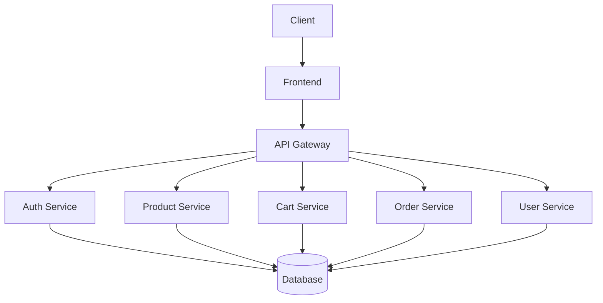

# System Architecture

## Overview

Arnold Commerce is built using a modern microservices architecture, designed for scalability and maintainability. The system is divided into several key components that work together to provide a seamless e-commerce experience.

## High-Level Architecture

## Components

### 1. Frontend
- **Framework**: Next.js 14 with TypeScript
- **State Management**: React Query
- **Styling**: Tailwind CSS with shadcn/ui components
- **Features**:
  - Server-side rendering
  - Static site generation
  - Progressive Web App (PWA) support
  - Responsive design

### 2. Backend Services

#### API Gateway
- **Technology**: Express.js
- **Responsibilities**:
  - Request routing
  - Rate limiting
  - Request validation
  - Authentication/Authorization

#### Auth Service
- **Features**:
  - User registration/login
  - JWT token management
  - OAuth 2.0 integration
  - Role-based access control

#### Product Service
- **Features**:
  - Product CRUD operations
  - Inventory management
  - Product search and filtering
  - Category management

#### Cart Service
- **Features**:
  - Shopping cart management
  - Guest cart support
  - Cart persistence
  - Price calculations

#### Order Service
- **Features**:
  - Order processing
  - Payment integration
  - Order history
  - Status tracking

#### User Service
- **Features**:
  - User profile management
  - Address book
  - Order history
  - Preferences

### 3. Data Layer
- **Primary Database**: PostgreSQL
- **ORM**: Prisma
- **Caching**: Redis
- **Search**: Elasticsearch
- **Object Storage**: AWS S3

### 4. Infrastructure
- **Containerization**: Docker
- **Orchestration**: Kubernetes
- **CI/CD**: GitHub Actions
- **Monitoring**: Prometheus + Grafana
- **Logging**: ELK Stack

## Communication Flow

1. Client makes a request to the frontend
2. Frontend makes API calls to the backend
3. API Gateway routes the request to the appropriate service
4. Service processes the request and interacts with the database
5. Response is sent back through the API Gateway to the frontend
6. Frontend updates the UI based on the response

## Security Considerations

- All communications are encrypted using HTTPS
- Sensitive data is encrypted at rest
- Rate limiting and DDoS protection
- Regular security audits and dependency updates
- Secure authentication with JWT and refresh tokens
